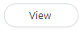
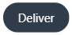

# Context

This is a procedural goal-oriented article describing how influencers could submit their social media posts to their unique portals, referred to as the Live URL, so the brands that they work with could view the content in their platforms. By viewing content in the platform, brands would be able to confirm the influencer completed their social media task as part of a marketing campaign and review the engagement statistics the influencer generated for the post. This article assumed these influencers had experience working with brands as well as some previous knowledge about the Live URL's features and functionality.

This article was publicly available since my time at this company, so I have not redacted any of the content. The current version can be viewed [here](https://help.grin.co/docs/manually-uploading-content). I was the primary contributor to the version shown below.

# Manually Uploading Content

If you’ve been assigned non-network tasks or you haven’t connected your social networks, you can complete tasks with collaborating brands by **manually uploading content** via your Live URL. When you manually upload, you have to provide a combination of a file copy of your content, a link, and the metrics associated with your content depending on the type of task you’re completing.

> **Note**
>
> * Some social network uploads, such as Instagram Stories, must be captured before they expire.
> * Manually uploading content can be time consuming and potentially inaccurate for delivering social network tasks (such as Instagram or TikTok) as your content metrics change. This may affect how your collaborating brands perceive your content’s performance. To ensure you always share your content with the most up-to-date stats, we **highly recommend** connecting your social accounts with GRIN. This allows GRIN to automatically pull your content and metrics directly from your accounts and share that data directly with your collaborating brands. 
> * You can learn how to connect your social networks with our help articles in [Managing Social Networks](https://help.grin.co/v1/docs/managing-social-networks). For more information on how GRIN uses your data, you can check out our help articles [Creator Data Privacy](https://help.grin.co/v1/docs/creator-data-privacy) and [Understanding First-Party Data.](https://help.grin.co/v1/docs/understanding-first-party-data)

## What You'll Need 

* Your **Live URL.** If you don’t have a Live URL, contact your collaborating brand to generate one for you.
* An active **program** with a collaborating brand that you can deliver content to  
* If you’re delivering for a **social network task** (such as an Instagram post or TikTok video), you’ll need an **image or video file** copy of your content, your post’s **URL**, your post’s **date of post** (if applicable), and your post’s **engagement metrics** from within the first 24 hours of your posting
* If you’re delivering for a **non-network task**, the requirements will be different depending on the type:
  * **File Upload:** An image, video, Word document, or PDF file 
  * **URL:** A link to your content 
  * **Text:** Copy and pasted text of your content, such as a post, blog, or review

## How to Do It 

1. Navigate to your **Live URL.**
2. Press **View** </img> on the program you’re submitting content for.
3. In the **Tasks** module, press **Deliver** </img>.
4. Press **View** </img> on the task you’re submitting content for. 
5. Depending on the type of task you’re delivering for, provide the following: 
   1. If you’re delivering for a **social network task**, such as an Instagram post or a TikTok video, then upload </img> your **file copy**, enter your post’s **URL** and **date of post** (if applicable), and enter your post’s **metrics**.
   2. If you’re delivering for a **non-network task**, upload </img> your **file**, enter your **URL**, or paste in your **text**.
6. Press **Deliver** </img>.

That’s it! Your content has been delivered. Your collaborating brand should receive a copy of your post, its URL, and its metrics. 
