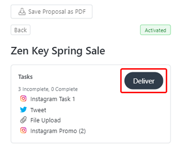
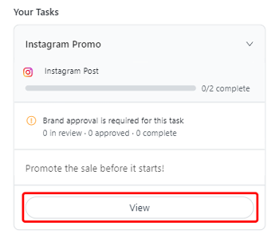
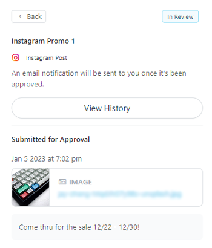

# Context 

This is a procedural goal-oriented article describing how influencers could submit their social media posts to their unique portals, referred to as the **Live URL**, so the brands that they work with can approve their content on this company's platform before influencers uploaded it to their social media profiles. This article assumed these influencers had experience working with brands as well as some previous knowledge about the **Live URL's** features and functionality.

This article was publicly available since my time at this company, so I have not redacted any of the content. The current version can be viewed [here](https://help.grin.co/v1/docs/submitting-content-for-approval). I was the primary contributor to the version shown below.

# Submitting Content for Approval

Your brand sometimes may require you to get your content approved before posting it, which means you'll need to upload it to the Live URL. Once your content is ready, you can submit it for approval to your brand via your program proposal. Then, your brand will be notified that your content is ready for their review. 

## What You'll Need 
* A **Live URL.** If you don't have a Live URL, contact the brand you're working with so they can generate a URL for you. 
* An accepted proposal with tasks requiring approval for an Activation. Submitting a proposal means you've accepted the brand's requirements and are officially part of the Activation. For more information, see our help article [Submitting a Proposal.](https://help.grin.co/docs/submitting-a-proposal) 
* The content you're submitting ready for file upload 

## How to Do It 
1. Navigate to your **Live URL.**
2. Press **View** on the Activation you're submitting content for. This will open your proposal for the Activation. 
3. In the **Tasks** module, press **Deliver.**

4. Press **View** on the task you need to submit content for. Content that requires approval will be labeled. 

5. If the task has two or more deliverables, **select** which deliverable you're submitting content for approval. Otherwise, skip to **Step 6.**
6. Press **Upload File** to upload your post. If the brand wants to approve your **caption** (which includes your post's description, hashtags, or mentions), enter that as well. 
7. Press **Submit for Approval.** This will let the brand know that your content is ready for them to review. 

> **Note** 
>
> Once your brand has reviewed your content, you'll get an email notification at the address you provded in your Live URL **Settings.** Be sure to have your preferred email set! For more information on updating your settings, see our help article [Managing Settings](https://help.grin.co/docs/managing-settings).
>
> You can always return to the deliverable's page to view your approval status, view your submission history by pressing **View History**, and view your most recent submission. Once your brand reviews your content, you'll see a new status, either **Needs Changes** or **Approved,** on your submission. 
> 

<ol start="8"><li>After your brand has reviewed your content, return to your task using <b>Steps 2-5</b> and view your submission. Depending on its status, you'll need to do different things:</li>
  <ol type="a"><li>If it's marked <b>Needs Changes</b>, revise your content according to your brand's feedback, then press <b>Edit Upload</b> and repeat <b>Steps 6-7.</b></li>
    <li>If it's marked <b>Approved</b>, your brand is happy with your content, and the approval process is completed.</li></ol></ol>
    
That's it! Your content has been approved for posting by your brand. Be sure to check if there's an agreed upon post date. Otherwise, you can post your content whenever you're ready. 
